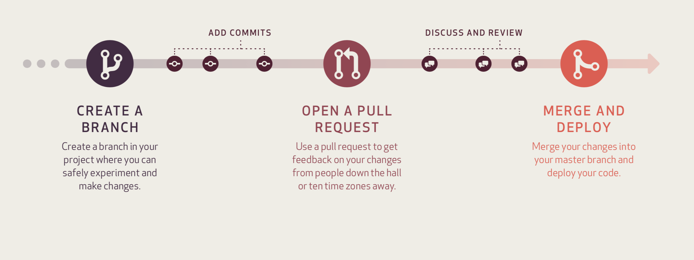

\newpage

# Workflows {-}

## GitHub Workflow {-}

This is our recommended workflow. The workflow is branch-based and involves keeping the master branch clean and 'production ready'/fully-functional at all times. The workflow is from GitHub and can be seen here: https://guides.github.com/pdfs/githubflow-online.pdf 

```{r echo = FALSE, fig.align = 'center', out.width = '95%'}

```

1. **Create a branch** - topic/per-person branches created from the master allow teams to contribute to seperate issues at the same time.
2. **Add commits** - these are snapshots of development within a branch and create safe, revertible points in the project's history.
3. **Open a pull request** - pull requests are the mechanism for which modifed code within a branch is merged back into the master branch, i.e. bringing the master branch up to date with changes made within a branch.
4. **Discuss and review code** - teams participate in code reviews by commenting, testing, and reviewing open pull requests. Pull requests should be approved by at least one collaborator - we recommend you assign a specific reviewer(s) to check the work. In order to ensure the master branch remains 'production ready' we also recommend that the master branch is protected and any changes are tested by the reviewer before approving.
5. **Merge** - upon clicking merge, GitHub automatically performs the equivalent of a local `git merge` operation. Although you'll likely never have to manually enter this command, it's good to understand that the buttons available for interaction with Git are just performing these commands for us. GitHub also keeps the entire branch development history on the merged pull request.
6. **Deploy** (*optional*) - teams can choose the best release cycles or incorporate continuous integration tools and operate with the assurance that code on the deployment branch has gone through a robust workflow.
